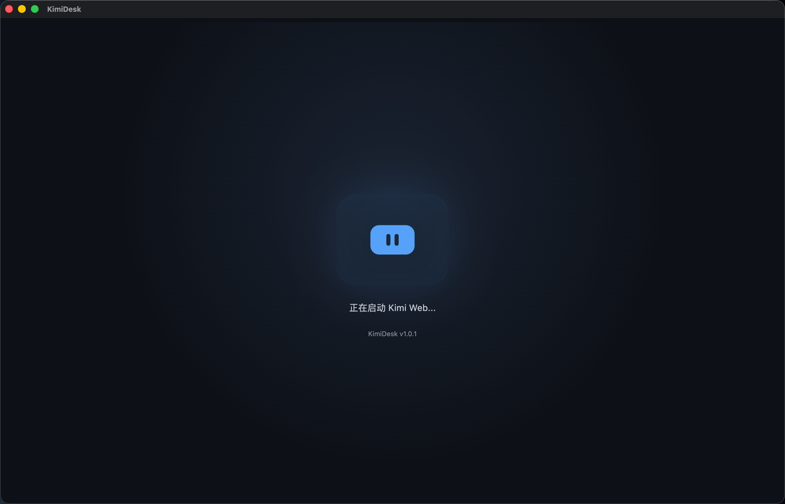
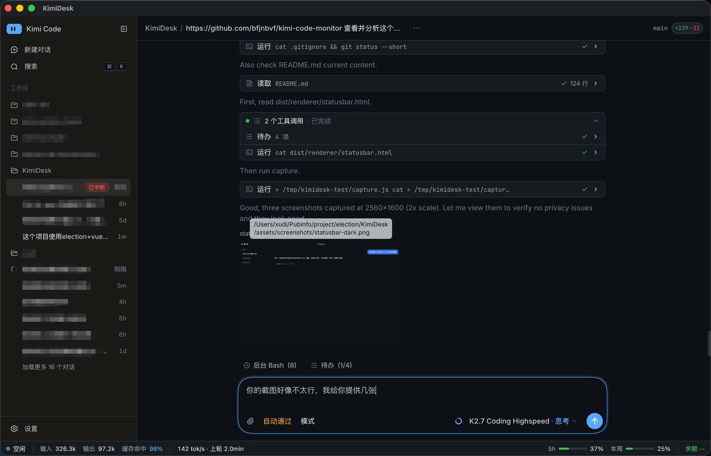

<p align="center">
  
</p>

<h1 align="center">KimiDesk</h1>

<p align="center">
  Kimi Code Web UI 的桌面端 wrapper
  <br>
  <sub>Electron · Vue 3 · TypeScript</sub>
</p>

<p align="center">
  
  
  
  
  
</p>

---

## ✨ 功能

- 🚀 自动启动 `kimi web` 后台服务
- 🪟 在 Electron 窗口中加载 Kimi Web UI
- 🔑 自动读取 token 并注入请求头，无需手动认证
- 🔔 支持系统通知，点击通知可聚焦窗口
- 🍎 macOS 状态栏图标，支持显示/隐藏窗口
- ♻️ 若系统已有 `kimi web` 在运行，直接复用不重复启动
- 🧹 退出应用时自动关闭由本应用启动的 `kimi web`
- 📊 底部状态栏实时显示当前会话 token、缓存命中率、生成速度、耗时、额度和加油包余额
- ⬆️ 启动时自动检查 kimi code 更新，可一键升级并重启

## 📦 环境要求

- [Node.js](https://nodejs.org/) 22+
- [pnpm](https://pnpm.io/)
- macOS / Windows / Linux（当前主要适配 macOS）

## 🚀 快速开始

```bash
# 安装依赖
pnpm install

# 开发运行
pnpm run dev
```

启动后会自动打开 Electron 窗口并加载 Kimi Web UI。

## 🛠️ 命令

| 命令 | 说明 |
|------|------|
| `pnpm run dev` | 开发运行 |
| `pnpm run build` | 构建 renderer / preload / main |
| `pnpm run dist` | 打包应用 |

打包产物位于 `release/` 目录：

- **macOS**: `release/mac-arm64/KimiDesk.app`、`release/KimiDesk-1.1.1-arm64.dmg`
- **Windows**: `release/win-unpacked/`、`release/KimiDesk-1.1.1.exe`
- **Linux**: `release/linux-unpacked/`、`release/KimiDesk-1.1.1.AppImage`

## 📊 状态栏

KimiDesk 窗口底部固定状态栏，实时展示当前会话核心指标，并随 Kimi Work 明暗主题自动切换样式。

| 主界面（深色主题） | 启动页 |
|---|---|
|  |  |

## 📁 项目结构

```
KimiDesk/
├── src/
│   ├── main/              # Electron 主进程
│   │   ├── index.ts       # 主进程入口
│   │   ├── kimi-web.ts    # kimi web 服务管理
│   │   ├── monitor.ts     # 会话指标采集
│   │   ├── quota.ts       # 额度/余额查询
│   │   ├── updater.ts     # kimi code 更新检查与升级
│   │   ├── window.ts      # 窗口与视图布局
│   │   ├── tray.ts        # 状态栏图标
│   │   └── store.ts       # 本地配置存储
│   ├── preload/           # preload 脚本
│   └── renderer/          # Vue 3 渲染进程
├── assets/                # 图标、图片资源
├── build/                 # 应用图标（electron-builder 使用）
├── dist/                  # 编译输出
├── release/               # 打包输出
├── .plan/                 # 开发计划
├── AGENTS.md              # 项目协作指南
├── package.json
├── vite.config.ts
├── tsconfig*.json
└── electron-builder.json
```

## 🎨 图标

- SVG 源文件：`assets/kimi-logo.svg`
- 应用图标：`build/icon.png`
- 状态栏图标：`assets/trayTemplate.png`、`assets/trayTemplate@2x.png`

## 📝 更新日志

### 1.1.1

- 修复 kimi code 自动更新失效、反复提示更新的问题：kimi 0.28.1/0.29.0 的 `kimi upgrade` 会把平台误识别为 windows 并拒绝自升级，但仍以 exit 0 退出，应用误判升级成功
- 升级后强制重新校验 `kimi --version` 是否达到目标版本；未达标时自动回退执行官方安装脚本（macOS/Linux），仍失败则提示手动升级

### 1.1.0

- 新增底部状态栏：实时显示当前会话 token、缓存命中率、生成速度、耗时、额度和加油包余额
- 状态栏自动适配 Kimi Work 明暗主题
- 状态栏指标支持鼠标悬停查看详情 tooltip
- 启动时自动检查 kimi code 更新，启动页可一键升级并重启
- 修复首次打开旧会话时状态栏不更新：旧会话未驻留服务端时 WS 订阅需 resync（拉一条消息触发加载后重新订阅获取事件回放），且 `history.replaceState` 导航不触发 `did-navigate-in-page`（preload 轮询 URL 变化兜底上报）

### 1.0.1

- 单实例模式：防止重复打开多个 KimiDesk
- 记住窗口位置和大小
- macOS Command+W 隐藏窗口
- 启动失败时弹出原生错误对话框
- kimi web 异常退出自动重试（最多 3 次）
- 日志写入 `~/Library/Logs/KimiDesk/`

### 1.0.0

- 初始版本：Electron + Vue 3 + TypeScript 桌面端 wrapper
- 启动/复用 `kimi web` 服务
- 自动 token 认证
- macOS 状态栏图标与系统通知
- 打包安装支持

## ⚠️ 注意事项

- `kimi web` 默认端口为 `58627`，若被占用会自动复用已有服务。
- 应用退出时只会关闭由本应用启动的 `kimi web` 进程；复用已有服务时不会关闭它。
- macOS 首次运行需要在「系统设置 → 通知」中允许 KimiDesk 发送通知。
- macOS 打包使用登录钥匙串中的自签名证书 `KimiDesk Local` 签名（`electron-builder.json` 的 `mac.identity`）。不可省略：默认 ad-hoc 签名的标识与 bundle id 不匹配，会导致系统通知被 macOS 静默拒绝。证书重建方法见 `AGENTS.md`。

## 📄 许可证

[ISC](LICENSE)
